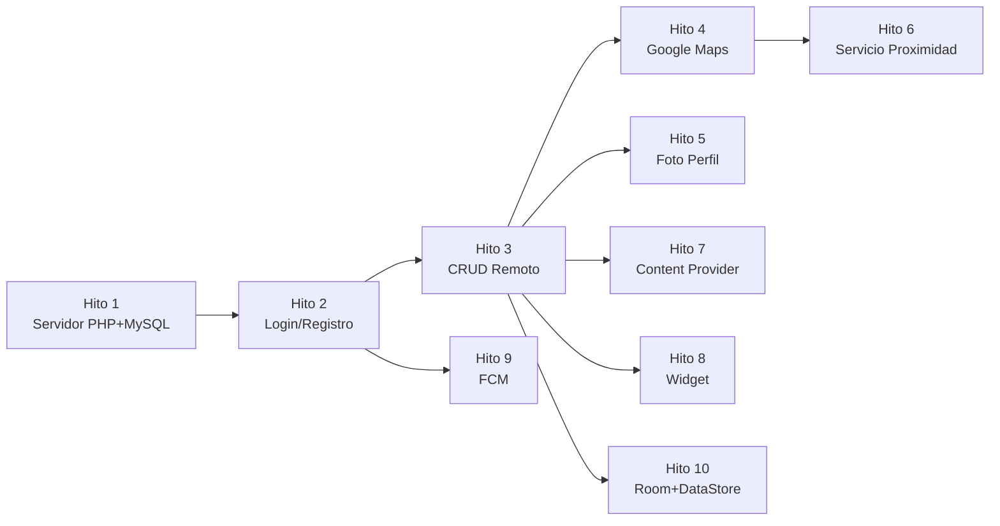

# Segunda Evaluación — Roadmap de Implementación

## Decisiones de Arquitectura (Confirmadas)

| Decisión | Respuesta |
|---|---|
| Servidor | Google Cloud (Apache + PHP + MySQL), HTTP |
| CRUD de tareas | 100% remoto (migrar de SQLite local a MySQL) |
| Geolocalización | Campo ubicación por tarea, icono en lista abre Google Maps |
| Cámara | Foto de perfil del usuario |
| Servicio Foreground | Tracking de ubicación → notificación si estás a <200m de tarea pendiente |
| Widget | Lista de las próximas 3 tareas |
| FCM | Push notification desde PHP |
| Mapas | Google Maps (API Key desde Google Cloud) |
| Objetivo | 🏆 Excelente (todos los opcionales) |

---

## Hitos de Implementación

### Hito 1: Infraestructura del Servidor
> Montar el backend PHP + MySQL en Google Cloud

| # | Tarea | Detalle |
|---|-------|---------|
| 1.1 | Crear BD MySQL en el servidor | Tablas: `usuarios` (id, nombre, email, password_hash, foto_url), `tareas` (id, usuario_id FK, titulo, descripcion, prioridad, fechaLimite, completada, latitud, longitud) |
| 1.2 | PHP: `registro.php` | Recibe nombre, email, password. Hashea con `password_hash()`. Inserta en `usuarios`. Devuelve JSON |
| 1.3 | PHP: `login.php` | Recibe email, password. Verifica con `password_verify()`. Devuelve JSON con datos del usuario |
| 1.4 | PHP: `tareas.php` | Parámetro `accion` para diferenciar: `getTareas`, `insertTarea`, `updateTarea`, `deleteTarea`, `deleteCompletadas`. Todas filtradas por `usuario_id` |
| 1.5 | PHP: `perfil.php` | Subida de foto de perfil (recibe imagen en base64 o multipart). Guarda en carpeta del servidor. Devuelve URL |
| 1.6 | PHP: `fcm_enviar.php` | Página web sencilla con formulario: título + mensaje → envía push FCM al token guardado |

---

### Hito 2: Auth en Android (Login / Registro)
> Flujo de autenticación antes de acceder a la app

| # | Tarea | Detalle |
|---|-------|---------|
| 2.1 | `AndroidManifest.xml` | Añadir `INTERNET`, `usesCleartextTraffic="true"` |
| 2.2 | `build.gradle` (app) | Añadir dependencia `WorkManager` (`androidx.work:work-runtime`) |
| 2.3 | Crear `LoginActivity` | Layout: email + password + botones login/registro. Lanzada como primera pantalla si no hay sesión |
| 2.4 | Crear `RegistroActivity` | Layout: nombre + email + password + confirmar password |
| 2.5 | Crear `ConexionWorker` | Worker genérico reutilizable para peticiones HTTP POST. Recibe URL + parámetros vía `Data`. Devuelve resultado JSON vía `Data` |
| 2.6 | Gestión de sesión | Guardar `usuario_id`, `nombre`, `email` en `SharedPreferences` al iniciar sesión. `MainActivity.onCreate()` redirige a `LoginActivity` si no hay sesión |
| 2.7 | Opción cerrar sesión | Añadir en Navigation Drawer → borra SharedPreferences y vuelve a `LoginActivity` |

---

### Hito 3: Migrar CRUD de Tareas a Remoto
> Sustituir SQLite local por llamadas HTTP al servidor

| # | Tarea | Detalle |
|---|-------|---------|
| 3.1 | Refactorizar `DBmanager` | Reemplazar queries SQLite por llamadas a `ConexionWorker` contra `tareas.php` |
| 3.2 | Añadir campos `latitud` y `longitud` | En la tabla remota y en los métodos de insert/update |
| 3.3 | Actualizar `AddTareaActivity` | Añadir campo de ubicación (EditText o botón "Seleccionar ubicación") + enviar lat/lng al servidor |
| 3.4 | Actualizar `EditTareaActivity` | Cargar y permitir editar la ubicación de la tarea |
| 3.5 | Actualizar `ListaTareasFragment` | Cambiar Cursor → List/Adapter con datos del JSON remoto |
| 3.6 | Actualizar `DetalleTareaFragment` | Mostrar datos desde remoto, incluir icono de ubicación |
| 3.7 | Actualizar `TareasAdapter` | Añadir icono de ubicación 📍 que al pulsar abra Google Maps |
| 3.8 | Eliminar `DBconexion.java` y `DBmanager` (local) | Cuando toda la lógica esté migrada. O renombrar `DBmanager` para que encapsule las llamadas remotas |

> [!WARNING]
> Este es el hito más complejo. Cambia todo el flujo de datos de la app. Sugiero mantener `DBmanager` como fachada pero que internamente haga las llamadas HTTP en vez de SQLite.

---

### Hito 4: Google Maps + Geolocalización
> Mostrar ubicaciones de tareas en mapa

| # | Tarea | Detalle |
|---|-------|---------|
| 4.1 | `build.gradle` | Añadir `play-services-maps` y `play-services-location` |
| 4.2 | Configurar API Key | `AndroidManifest.xml` → `<meta-data android:name="com.google.android.geo.API_KEY">` |
| 4.3 | Permisos | `ACCESS_FINE_LOCATION`, `ACCESS_COARSE_LOCATION` con solicitud en runtime |
| 4.4 | Crear `SeleccionarUbicacionActivity` | Mapa a pantalla completa. El usuario toca para poner un marcador. Botón "Confirmar" devuelve lat/lng al formulario (via `ActivityResult`) |
| 4.5 | Integrar en formularios | Botón "📍 Seleccionar ubicación" en `AddTareaActivity` y `EditTareaActivity`. Al pulsar, abre `SeleccionarUbicacionActivity` |
| 4.6 | Icono en la lista de tareas | En `TareasAdapter`: si la tarea tiene lat/lng, mostrar icono 📍. Al pulsar → abrir Google Maps con `Intent(ACTION_VIEW, "geo:lat,lng")` o navegar a una actividad propia con mapa |

---

### Hito 5: Cámara + Foto de Perfil
> Captar foto desde cámara y subirla al servidor

| # | Tarea | Detalle |
|---|-------|---------|
| 5.1 | Permiso `CAMERA` | Manifest + solicitud en runtime |
| 5.2 | Header del Navigation Drawer | Mostrar `ImageView` circular con foto de perfil + nombre del usuario |
| 5.3 | Capturar foto | `ActivityResultLauncher` con `ACTION_IMAGE_CAPTURE`. Guardar en `FileProvider` |
| 5.4 | Subir al servidor | Worker que envíe imagen (base64 o multipart) a `perfil.php`. Servidor guarda archivo y devuelve URL |
| 5.5 | Mostrar foto | Cargar URL de la foto desde el servidor. Usar librería como Glide o Picasso para cargar en `ImageView` |
| 5.6 | `build.gradle` | Añadir Glide o Picasso para carga de imágenes |
| 5.7 | `FileProvider` en manifest | Para compartir la URI del archivo temporal de la foto |

---

### Hito 6: Servicio en Primer Plano (Proximidad)
> Servicio que trackea ubicación y notifica si estás cerca de una tarea pendiente

| # | Tarea | Detalle |
|---|-------|---------|
| 6.1 | Crear `ProximidadService extends Service` | Notificación persistente ("Monitorizando tareas cercanas") |
| 6.2 | Permiso `FOREGROUND_SERVICE` + tipo | En manifest, `android:foregroundServiceType="location"` |
| 6.3 | `ACCESS_BACKGROUND_LOCATION` | Necesario para tracking continuo. Solicitud especial en runtime |
| 6.4 | Location tracking | `FusedLocationProviderClient` + `LocationRequest` dentro del servicio |
| 6.5 | Lógica de proximidad | Obtener tareas pendientes con ubicación. Calcular distancia con `Location.distanceTo()`. Si <200m → notificación |
| 6.6 | Broadcast | Enviar broadcast desde el servicio cuando detecta proximidad. Receiver en la actividad para actualizar UI |
| 6.7 | Controles | Botón en la app para iniciar/detener el servicio. Estado visible en la UI |

---

### Hito 7: Content Provider
> Exponer tareas de la app a otras aplicaciones

| # | Tarea | Detalle |
|---|-------|---------|
| 7.1 | Crear `TareasContentProvider extends ContentProvider` | Authority: `com.example.dasproyecto.provider` |
| 7.2 | Implementar `query()`, `insert()`, `update()`, `delete()` | Usando la misma lógica que el `DBmanager` remoto |
| 7.3 | Definir URIs | `content://com.example.dasproyecto.provider/tareas` + `tareas/#` |
| 7.4 | Registrar en manifest | `<provider>` con authority y `exported="true"` |
| 7.5 | Usar el Content Provider internamente | Que al menos una parte de la app acceda a datos a través del `ContentResolver` en lugar de directamente |

---

### Hito 8: Widget (3 Próximas Tareas)
> Widget que muestra las próximas 3 tareas pendientes

| # | Tarea | Detalle |
|---|-------|---------|
| 8.1 | Crear `TareasWidgetProvider extends AppWidgetProvider` | Maneja `onUpdate()` |
| 8.2 | Layout XML del widget | `widget_tareas.xml`: título + 3 filas (título tarea + fecha) |
| 8.3 | `widget_info.xml` | `updatePeriodMillis` para actualización automática, `minWidth/minHeight` |
| 8.4 | Registrar en manifest | `<receiver>` con `<intent-filter>` `APPWIDGET_UPDATE` + `<meta-data>` widget_info |
| 8.5 | Fetch datos remotos | En `onUpdate()`, obtener las 3 próximas tareas del servidor y actualizar `RemoteViews` |
| 8.6 | Click handler | Al pulsar el widget, abrir `LoginActivity` |

---

### Hito 9: Firebase Cloud Messaging
> Push notifications desde servidor PHP

| # | Tarea | Detalle |
|---|-------|---------|
| 9.1 | Registrar proyecto en Firebase Console | `google-services.json` en carpeta `app/` |
| 9.2 | `build.gradle` | Plugin `google-services` + dependencias `firebase-messaging` |
| 9.3 | `build.gradle` (proyecto) | Plugin `com.google.gms.google-services` |
| 9.4 | Crear `MiFirebaseMessagingService` | Override `onMessageReceived()` → mostrar notificación. Override `onNewToken()` → enviar token al servidor |
| 9.5 | PHP: guardar token FCM | Añadir campo `fcm_token` en tabla `usuarios`. Actualizar al hacer login |
| 9.6 | PHP: `fcm_enviar.php` | Formulario web simple (título + mensaje + usuario). Usa la API HTTP v1 de FCM para enviar push |
| 9.7 | Registrar servicio en manifest | `<service>` con intent-filter de FCM |

---

### Hito 10: Persistencia Moderna (Room + DataStore)
> Reimplementar la capa de persistencia local usando el estándar actual de Google (Single Source of Truth)

| # | Tarea | Detalle |
|---|-------|---------|
| 10.1 | Dependencias | Añadir `room-runtime`, `room-compiler` y `datastore-preferences` en `build.gradle` |
| 10.3 | Entidad Room | Crear `@Entity` `TareaEntity` que refleje el modelo SQLite actual |
| 10.4 | DAOs de Room | Crear `@Dao` `TareaDao` con operaciones CRUD (`getTareas()`, `insert()`, `delete()`) |
| 10.5 | Base de Datos | Crear clase abstracta `AppDatabase extends RoomDatabase` |
| 10.6 | Repository | Crear `TareaRepository` para abstraer la decisión de acceder a Room (caché local) o `ConexionWorker` (remoto) |
| 10.7 | Sync Periódico | Configurar `PeriodicWorkRequest` de WorkManager para sincronizar DB silenciosamente (Local ← Remoto) |
| 10.8 | ContentProvider | Refactorizar `TareasContentProvider` para hacer consultas sobre Room (`TareaDao.getCursor()`) |

---

## Orden de Implementación Sugerido

> [!IMPORTANT]
> Los **Hitos 1 → 2 → 3** son secuenciales y obligatorios primero.  
> Los **Hitos 4-9** pueden hacerse en paralelo tras completar el Hito 3 (excepto H6 que depende de H4).

## Estimación de Esfuerzo

| Hito | Archivos nuevos | Archivos modificados | Complejidad |
|------|--:|--:|---|
| H1 (Servidor) | ~6 PHP | 0 | ⭐⭐⭐ |
| H2 (Auth) | 4-5 Java + layouts | 3 | ⭐⭐ |
| H3 (CRUD remoto) | 1-2 Java | 6-8 | ⭐⭐⭐⭐ |
| H4 (Maps) | 2 Java + layouts | 4 | ⭐⭐⭐ |
| H5 (Foto) | 1-2 Java | 3-4 | ⭐⭐ |
| H6 (Servicio) | 2 Java | 2-3 | ⭐⭐⭐⭐ |
| H7 (Content Provider) | 1 Java | 1 | ⭐⭐ |
| H8 (Widget) | 1 Java + 2 XML | 1 | ⭐⭐ |
| H9 (FCM) | 2 Java + 1 PHP | 3 | ⭐⭐⭐ |
| H10 (Persistencia) | 5-6 Java | 4-5 | ⭐⭐⭐⭐⭐ |
